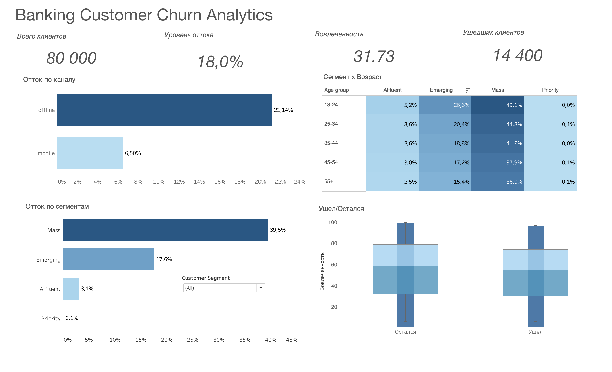

# Banking Customer Churn Analytics

Разобрала поведение 80 000 клиентов банка, чтобы понять, кто уходит, почему и можно ли это предсказать заранее.

## Зачем это

Банк теряет клиентов, но не понимает, на кого именно давить в retention-кампаниях. Я хотела найти сегменты с самым высоким риском, разобраться в причинах и построить модель, которая выделит группу для точечной работы.

## Данные

`bank_churn_dataset.csv` — 80 000 клиентов, 26 признаков. Демография, баланс, кредитный скор, engagement_score, risk_score, сегментация, канал использования. Целевая переменная — `exit` (ушёл или остался). Общий отток — 18%.

## Что я сделала

- **Аудит данных** — проверила пропуски, дубликаты, выбросы, диапазоны. Данные чистые, аномалий нет.
- **EDA** — отток по сегментам, каналам, возрастам. Отдельно посмотрела пересечения: сегмент × возраст, сегмент × канал.
- **SQL-запросы** — те же агрегаты на PostgreSQL: churn rate по группам, когорты по tenure, оконные функции.
- **Статтесты** — chi-square для категориальных факторов, Mann-Whitney для engagement, z-test для сравнения сегментов с доверительными интервалами.
- **Модель** — Logistic Regression как baseline, Random Forest как основная. Сравнила по ROC-AUC, выделила топ-20% риска.
- **Дашборд в Tableau** — KPI-плитки, отток по сегментам и каналам, heatmap, box plot.

## Что получилось

**Главный сегмент проблемы — Mass.** Отток 39.5% против 17.6% (Emerging), 3.1% (Affluent) и 0.07% (Priority). Mass — 27% базы, но даёт 59% всех уходов.

**Цифровой канал работает как отдельный рычаг.** Клиенты без мобильного приложения уходят в 3.25 раза чаще: 21.1% против 6.5%.

**Самая горячая точка — Mass + 18–24.** Отток 51% — уходит каждый второй. Mass + offline — 46%, Mass + mobile — 16.3%. Приложение смягчает, но не решает.

**Engagement — ранний сигнал.** Медиана у ушедших 16, у оставшихся 25. Разница значима по Манн-Уитни.

**Возраст и стаж — не фактор.** Вопреки ожиданиям, корреляция с оттоком почти нулевая (|r| < 0.07). Главный числовой предиктор — `risk_score` (r = 0.43).

**Модель.** Logistic Regression ROC-AUC 0.857, Random Forest 0.855. Обе на одном уровне — линейной границы после one-hot кодирования достаточно, нелинейные эффекты слабые. Recall по «Ушёл» — 0.84.

**Скоринг.** Топ-20% клиентов по предсказанному риску дают реальный churn 50.4% против среднего 18%. Разница в 2.8 раза.

## Что делать бизнесу

- Сфокусировать retention на Mass, особенно на возрасте 18–24 — там ядро проблемы.
- Переводить офлайн-клиентов Mass и Emerging в мобильное приложение. По данным, mobile снижает отток почти в 3 раза.
- Следить за engagement_score как ранним индикатором: падение ниже 20 — клиент в зоне риска.
- Использовать модель для скоринга: топ-20% по вероятности ухода — приоритет для точечных предложений.

## Дашборд

Собрала в Tableau: KPI, отток по сегментам и каналам, heatmap сегмент × возраст, box plot engagement.

## Стек

Python, pandas, PostgreSQL, scipy, statsmodels, scikit-learn, matplotlib, seaborn, Tableau.
